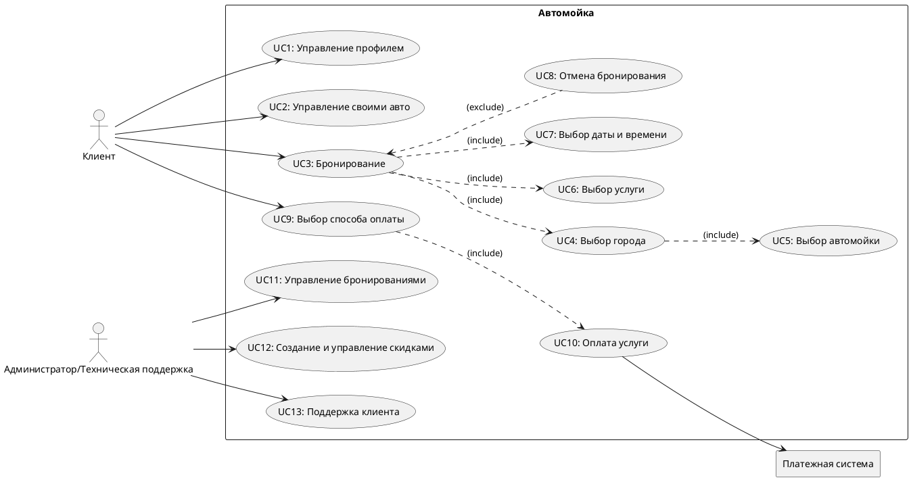

# Приложение для автомойки (Car Wash App) - Учебное приложение

## 📖 User Story

1. Я, как **ночной водитель**, хочу **услугу ночной мойки** 🌙, чтобы **экономить время и избегать очередей**.  
2. Я, как **владелец ретро-авто**, хочу **деликатную мойку с безопасными средствами** 🚗, чтобы **не повредить лакокрасочное покрытие**.  
3. Я, как **занятый человек**, хочу **услугу мойки на выезд** 🚐, чтобы **экономить время**.  
4. Я, как **владелец электромобиля**, хочу **доступ к зарядной станции во время мойки** ⚡, чтобы **зарядить авто одновременно с уходом за ним**.  
5. Я, как **любитель кофе**, хочу **кафе с качественными напитками** ☕, чтобы **наслаждаться ожиданием**.  
6. Я, как **активный пользователь мобильных приложений**, хочу **онлайн-запись с выбором времени и услуг** 📱, чтобы **планировать мойку удобно и быстро**.  
7. Я, как **владелец нового авто**, хочу **услугу нанесения защитного покрытия** 🛡️, чтобы **сохранить его вид и защитить от внешних воздействий**.  
8. Я, как **любитель животных**, хочу **услугу освижетеля воздуха** 🐾, чтобы **избавиться от запахов и бактерий**.  
9. Я, как **Клиент**, хочу **получать уведомление о готовности авто после мойки** 🕒, чтобы **знать, когда забирать машину**.  
10. Я, как **Клиент**, хочу **получать уведомления о скидках** 📢, чтобы **пользоваться выгодными предложениями на мойку**.  
11. Я, как **любитель бездорожья**, хочу **услуги глубокой мойки автомобиля** 🚙, чтобы **удалять сильные загрязнения с внедорожника**.  
12. Я, как **солидный человек**, хочу **доступ к услугам премиум-класса** 💼, чтобы **поддерживать свой статус**.  
13. Я, как **таксист**, хочу **ежедневное время со скидками на мойку** ⏳, чтобы **экономить на регулярном обслуживании**.
14. Я, как **автолюбитель**, хочу **услугу быстрой экспресс-мойки** ⏱️, чтобы **сэкономить время на уход за авто**.  
15. Я, как **владелец крупногабаритного авто**, хочу **удобный доступ к просторным боксам** 🚛, чтобы **быстро обслуживать свой транспорт**.  
16. Я, как **бизнесмен**, хочу **пакет услуг для корпоративного автопарка** 📊, чтобы **экономить на обслуживании машин компании**.      
17. Я, как **путешественник на автофургоне**, хочу **специальные боксы для кемперов** 🚐, чтобы **удобно помыть свой дом на колесах**.  
18. Я, как **житель снежных районов**, хочу **услугу обработки кузова антигололедным составом** ❄️, чтобы **защитить авто от соли и реагентов**.  
19. Я, как **владелец элитного авто**, хочу **персонального менеджера на мойке** 🤵, чтобы **получать индивидуальное обслуживание**.  
20. Я, как **автовладелец, часто путешествующий с детьми**, хочу **услугу чистки детских автокресел** 👶, чтобы **поддерживать их чистоту и гигиену**.  

## 🎯 Use Case Diagram

UserCase для этой структуры на [PlantTextUML](https://www.planttext.com/). 🔗

  
<h2>🧑💻🧑🏼💻🧑🏿💻Код:UserCase</h2>

  

## Сценарии использования

## **UC1: Управление профилем 👤**  
- **Участники**: Пользователь (клиент).  
- **Предусловия**: Пользователь зарегистрирован и авторизован.  
- **Условие запуска**: Пользователь переходит в раздел "Профиль".  
- **Признак успешности**: Пользователь может просматривать и редактировать свои данные.  

