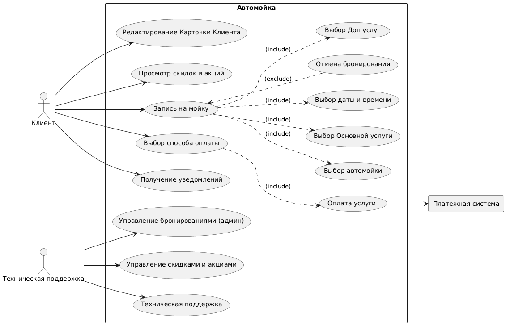
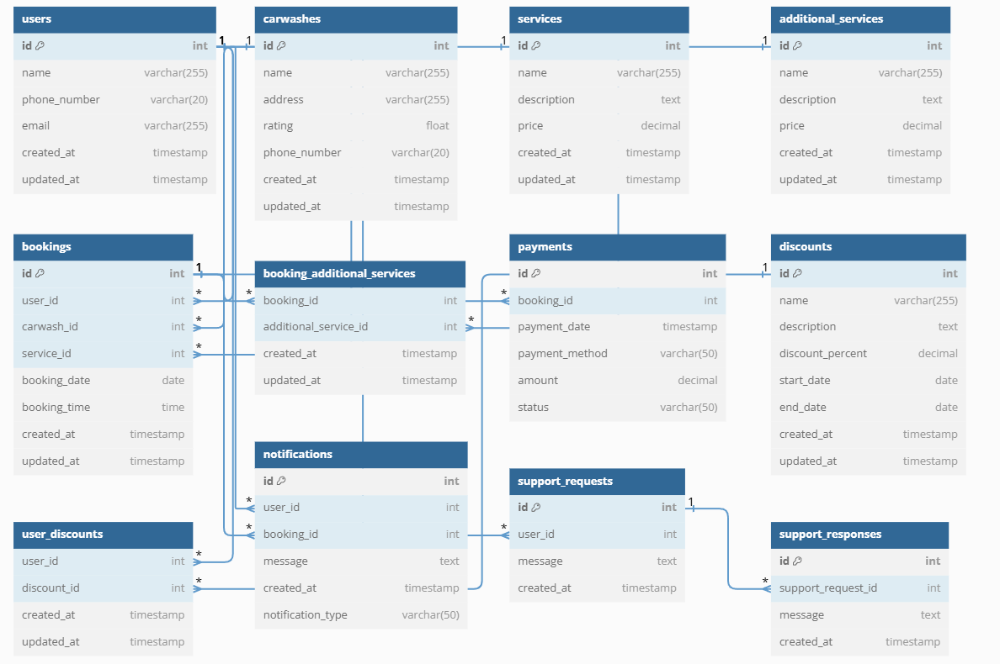
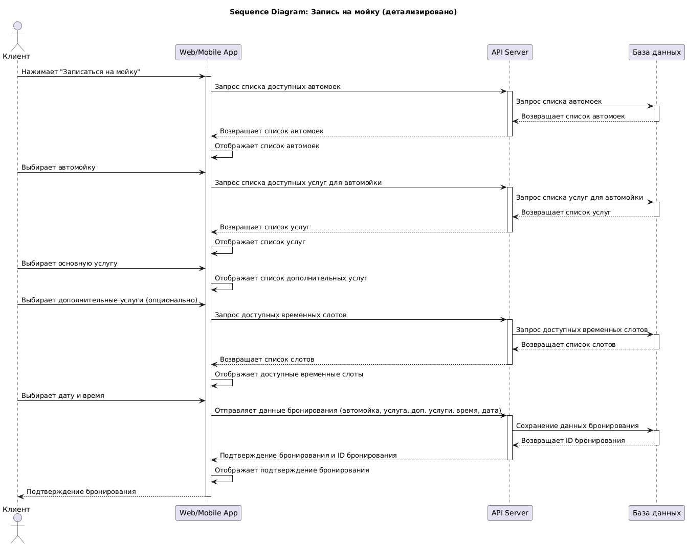
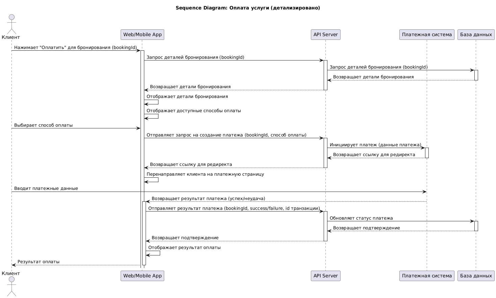
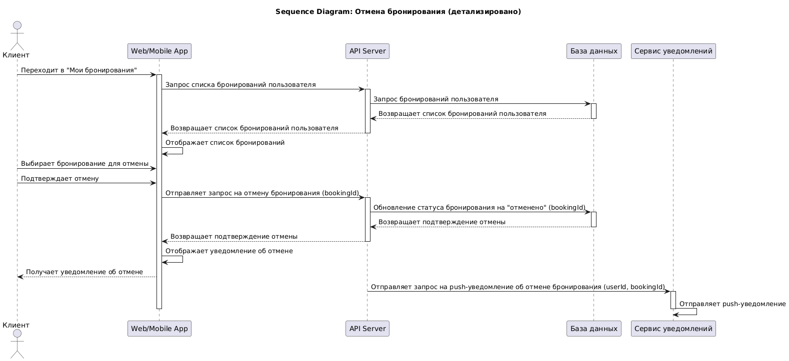
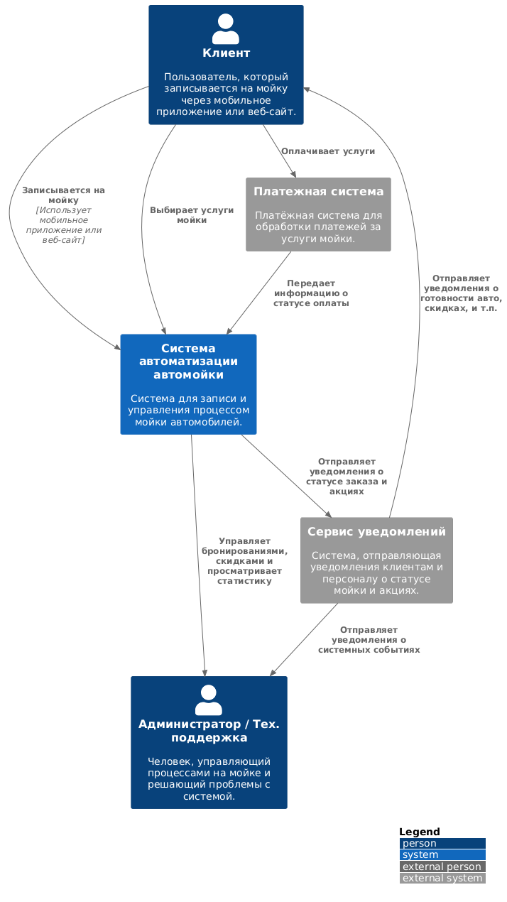
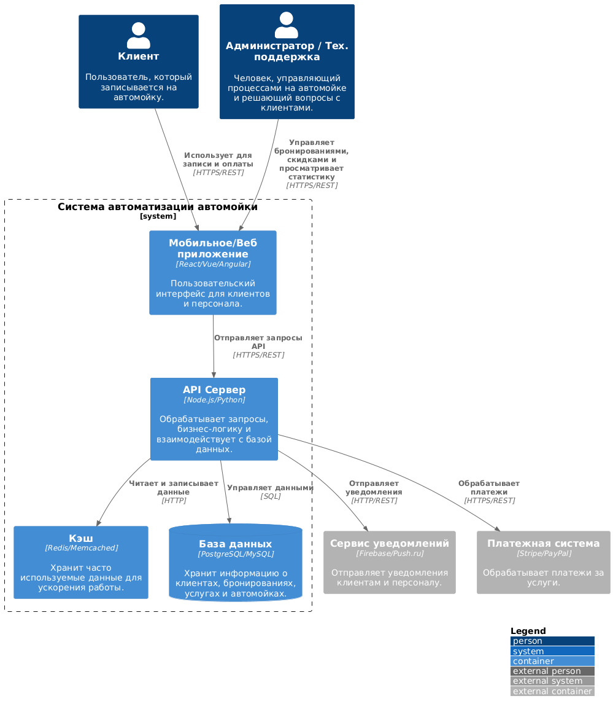
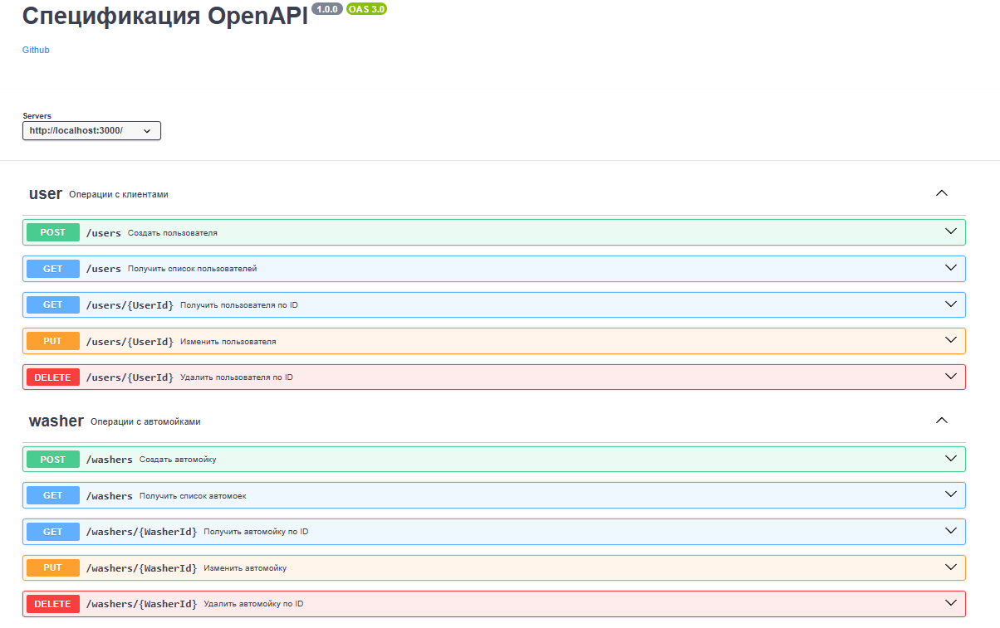
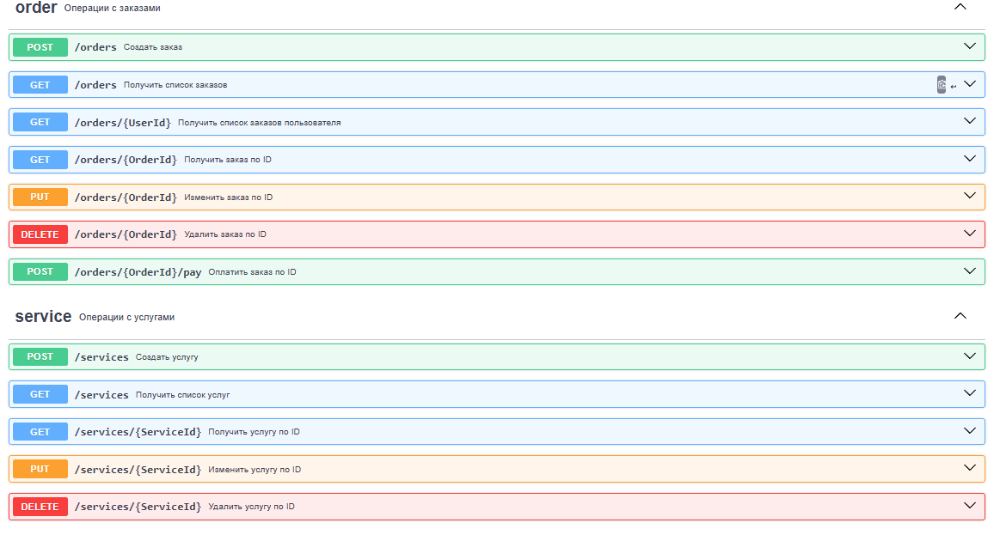

# Сервис записи на автомойку

## Описание проекта

Этот проект представляет собой сервис для записи клиентов на автомойку. Он позволяет пользователям просматривать доступное время, выбирать услуги, бронировать время и управлять своими записями. Проект разработан с применением современных подходов к проектированию и интеграции информационных систем, и включает в себя следующие элементы:

* **Use Case диаграмма:** Визуальное представление вариантов использования системы с точки зрения пользователя.
* **User Story:** Описание пользовательских потребностей в формате историй, на основе которых строится разработка.
* **Сценарии использования:** Подробное описание последовательности действий для выполнения конкретных задач в системе.
* **ER-диаграмма:** Схема сущностей и связей между ними, представляющая структуру данных приложения.
* **Sequence диаграммы:** Иллюстрация последовательности взаимодействий между объектами в системе для различных сценариев использования (представлено 3 варианта).
* **C4 модель (уровни C1 и C2):** Описание архитектуры системы на уровнях контекста (C1) и контейнеров (C2).
* **Спецификация OpenAPI Swagger:** Файл `openapi.yaml`, содержащий спецификацию REST API сервиса, позволяющую интегрироваться с ним через HTTP запросы.

## Цель проекта 🎯

Основная цель проекта - предоставить пользователям удобный и эффективный инструмент для онлайн-записи на автомойку, а также автоматизировать процессы управления записями для владельцев автомойки.

## User Stories 🚗

  
Клик ( подробно )

*   **Как автовладелец,** я хочу легко и быстро записаться на мойку на удобное время, чтобы не тратить много времени и усилий на этот процесс. ⏱️
*   **Как пользователь приложения,** я хочу иметь удобный и понятный интерфейс, чтобы навигация по сервису была интуитивной и приятной. Я хочу видеть информацию о мойке 🏢, доступных услугах 🧼 и свободных временных слотах. 📅
*   **Как клиент,** я хочу иметь возможность оплатить услугу заранее, чтобы не беспокоиться об этом в момент посещения мойки. 💳
*   **Как пользователь, планирующий свой день,** я хочу заранее получать уведомления о невозможности предоставления услуги в выбранное мной время, чтобы избежать поездок на мойку впустую. 🚦
*   **Как ответственный пользователь,** я хочу иметь возможность отменить свою запись, если мои планы изменятся, чтобы предупредить администраторов мойки и освободить временной слот для других клиентов. 🔄
*   **Как постоянный клиент,** я хочу получать доступ к системе скидок и специальных предложений, чтобы стимулировать мое повторное использование сервиса. 💰
*   **Как клиент, ожидающий окончания мойки,** я хочу получать уведомления на мой телефон о завершении услуги, чтобы не тратить время на постоянную проверку статуса. 🔔
*   **Как "голодный человек",** я хочу "кофе и покушать" чтобы "быть сытым и довольным.
*   **Как "водитель",** я хочу "омывайку и вонючки" чтобы "в машине всегда вкусно пахло и было чем протереть лобовое.
*   **Как "Программист",** я хочу " место для работы за ноутбуком и сетью" чтобы " заниматься своими делами пока моя машина моется.

## Сценарии Использования (Use Case Scenarios) 📝

   

  
Клик ( подробно )

### Актор: Клиент 👤

1.  **UC1: Редактирование Карточки Клиента ✍️**
    *   **Описание:** Клиент изменяет личную информацию в своем профиле.
    *   **Основной поток:**
        1.  Клиент входит в приложение и переходит в раздел "Профиль" 👤➡️⚙️.
        2.  Клиент выбирает пункт "Редактировать профиль" ✏️.
        3.  Клиент изменяет необходимые данные (например, имя 📝, номер телефона 📞, адрес электронной почты 📧).
        4.  Клиент подтверждает изменения ✅.
        5.  Система сохраняет изменения и показывает уведомление об успешном обновлении 🎉.
    *   **Альтернативный поток:**
        *   Клиент отменяет изменения и возвращается к просмотру профиля ❌.
        *   Система сообщает об ошибке при вводе некорректных данных ⚠️.
2.  **UC2: Просмотр скидок и акций 💰**
    *   **Описание:** Клиент просматривает список доступных скидок и акций.
    *   **Основной поток:**
        1.  Клиент входит в приложение и переходит в раздел "Скидки и акции" 👤➡️🏷️.
        2.  Система отображает список активных скидок и акций (с описанием и сроком действия) 📃.
        3.  Клиент просматривает детали интересующей акции/скидки 👀.
    *   **Альтернативный поток:**
        *   Нет доступных акций/скидок, система отображает сообщение об отсутствии 🚫.
3.  **UC3: Запись на мойку 🚗💦**
    *   **Описание:** Клиент записывается на мойку, включая выбор дополнительных услуг, автомойки, основной услуги, даты и времени.
    *   **Основной поток:**
        1.  Клиент входит в приложение и нажимает на кнопку "Записаться на мойку" 👤➡️📅.
        2.  Система перенаправляет клиента на `UC4: Выбор Доп услуг` ➕.
        3.  Система перенаправляет клиента на `UC5: Выбор автомойки` 📍.
        4.  Система перенаправляет клиента на `UC6: Выбор Основной услуги` 🧼.
        5.  Система перенаправляет клиента на `UC7: Выбор даты и времени` ⏱️.
        6.  Клиент подтверждает свой выбор ✅.
        7.  Система сохраняет бронирование и показывает подтверждение 🎉.
    *   **Альтернативный поток:**
        *   Клиент прерывает процесс записи на любом этапе и возвращается на главный экран 🔙.
        *   Нет доступных временных слотов или автомойка не работает, система сообщает об этом 🚧.
4.  **UC4: Выбор Доп услуг ➕**
    *   **Описание**: Клиент выбирает дополнительные услуги, если они требуются.
    *   **Основной поток:**
        1.  Клиент попадает на страницу "Выбор Доп услуг" 📃.
        2.  Система показывает список доступных дополнительных услуг 📃.
        3.  Клиент выбирает необходимые услуги и подтверждает выбор ✅.
        4.  Система сохраняет выбор и возвращает клиента к процессу записи 🔄.
    *   **Альтернативный поток:**
        *   Клиент не выбирает дополнительные услуги и переходит к следующему шагу ➡️.
5.  **UC5: Выбор автомойки 📍**
    *   **Описание:** Клиент выбирает автомойку из списка доступных.
    *   **Основной поток:**
        1.  Система показывает карту с доступными автомойками или список с информацией о них (адрес, рейтинг, доступные услуги) 🗺️.
        2.  Клиент выбирает автомойку 🚗.
        3.  Система сохраняет выбор и перенаправляет клиента к следующему шагу ➡️.
    *   **Альтернативный поток:**
        *   Нет доступных автомоек в выбранном городе, система сообщает об этом 🚫.
6.  **UC6: Выбор Основной услуги 🧼**
    *   **Описание:** Клиент выбирает основную услугу (например, "Стандартная мойка", "Экспресс мойка", "Детейлинг").
    *   **Основной поток:**
        1.  Система отображает список доступных основных услуг 📃.
        2.  Клиент выбирает услугу 🧼.
        3.  Система сохраняет выбор и перенаправляет клиента к следующему шагу ➡️.
    *   **Альтернативный поток:**
        *   Нет доступных услуг, система сообщает об этом 🚫.
7.  **UC7: Выбор даты и времени ⏱️**
    *   **Описание:** Клиент выбирает дату и время для записи на мойку.
    *   **Основной поток:**
        1.  Система отображает календарь с доступными временными слотами 📅.
        2.  Клиент выбирает желаемые дату и время ⏱️.
        3.  Система сохраняет выбор и перенаправляет клиента к следующему шагу ➡️.
    *   **Альтернативный поток:**
        *   Нет доступных временных слотов, система предлагает другие варианты 🔄.
8.  **UC8: Отмена бронирования ❌**
    *   **Описание:** Клиент отменяет свою запись на мойку.
    *   **Основной поток:**
        1.  Клиент переходит в раздел "Мои бронирования" 👤➡️📅.
        2.  Клиент выбирает запись, которую хочет отменить 📝.
        3.  Клиент подтверждает отмену ✅.
        4.  Система отменяет бронирование и показывает уведомление об этом 🗑️.
    *   **Альтернативный поток:**
        *   Клиент не может отменить бронирование (например, прошло слишком мало времени до записи), система показывает сообщение об этом ⚠️.
9.  **UC9: Выбор способа оплаты 💳**
    *   **Описание:** Клиент выбирает способ оплаты (например, банковская карта, электронный кошелек).
    *   **Основной поток:**
        1.  Система предлагает доступные способы оплаты 💳.
        2.  Клиент выбирает способ оплаты 💳.
    *   **Альтернативный поток:**
        *   Клиент отменяет процесс оплаты ❌.
10. **UC10: Оплата услуги 💸**
    *   **Описание:** Клиент оплачивает услугу через выбранную платежную систему.
    *   **Основной поток:**
        1.  Система перенаправляет клиента в выбранную платежную систему 🌐.
        2.  Клиент производит оплату 💸.
        3.  Платежная система подтверждает оплату ✅.
        4.  Система сохраняет информацию об оплате и показывает уведомление об успешной оплате 🎉.
    *   **Альтернативный поток:**
        *   Оплата не прошла успешно ❌.
11. **UC11: Получение уведомлений 🔔**
    *   **Описание**: Клиент получает уведомления о статусе бронирования, об изменениях, о завершении мойки.
    *   **Основной поток:**
        1. Клиент бронирует мойку 🚗💦.
        2. Система отправляет уведомление клиенту о подтверждении бронирования ✅.
        3. Система отправляет уведомление клиенту об изменениях, если они есть ⚠️.
        4. Система отправляет уведомление клиенту о завершении мойки 🏁.
    * **Альтернативный поток:**
        * Клиент не получает уведомление из-за проблем с сетью 📶.

### Актор: Техническая Поддержка 🛠️

12. **UC15: Управление бронированиями (админ) 📅**
    *   **Описание:** Техническая поддержка просматривает, изменяет или отменяет бронирования.
    *   **Основной поток:**
        1.  Техническая поддержка входит в административную панель ⚙️.
        2.  Система показывает список бронирований 📃.
        3.  Техническая поддержка выбирает бронирование для управления 📝.
        4.  Техническая поддержка может просматривать, изменять или отменять бронирование 👁️, ✏️, 🗑️.
        5.  Система сохраняет изменения ✅.
    *   **Альтернативный поток:**
        *   Система сообщает об ошибке, если бронирование невозможно изменить или отменить ⚠️.
13. **UC16: Управление скидками и акциями 🏷️**
    *   **Описание:** Техническая поддержка создает, редактирует или удаляет скидки и акции.
    *   **Основной поток:**
        1.  Техническая поддержка входит в административную панель ⚙️.
        2.  Техническая поддержка переходит в раздел "Скидки и акции" 🏷️.
        3.  Техническая поддержка может создавать, редактировать или удалять скидки и акции ➕, ✏️, 🗑️.
        4.  Система сохраняет изменения ✅.
    *   **Альтернативный поток:**
        *   Система сообщает об ошибке при создании/редактировании/удалении скидки или акции ⚠️.
14. **UC17: Техническая поддержка 📞**
    *   **Описание:** Техническая поддержка отвечает на запросы клиентов.
    *   **Основной поток:**
        1.  Техническая поддержка входит в административную панель ⚙️.
        2.  Техническая поддержка просматривает список обращений клиентов 📃.
        3.  Техническая поддержка отвечает на обращение 💬.
        4.  Система отправляет ответ клиенту 📧.
    *   **Альтернативный поток:**
        *   Техническая поддержка не может ответить на обращение (например, не хватает данных) ⚠️.
     
 

### ERD (Entity-Relationship Diagram)

*ERD полное описание*

  
Клик ( подробно )

  
### 1. `users` (Пользователи)

*   **Назначение:** Хранит информацию о пользователях системы.
*   **Поля:**
    *   `id int [pk, increment]`: Уникальный идентификатор пользователя (целое число, первичный ключ, автоматически увеличивается).
    *   `name varchar(255)`: Имя пользователя (текстовая строка длиной до 255 символов).
    *   `phone_number varchar(20)`: Номер телефона пользователя (текстовая строка длиной до 20 символов).
    *   `email varchar(255)`: Адрес электронной почты пользователя (текстовая строка длиной до 255 символов).
*   **Описание:** Эта таблица содержит основные сведения о пользователях сервиса, необходимые для их идентификации и связи с другими таблицами.

---

### 2. `carwashes` (Автомойки)

*   **Назначение:** Хранит информацию об автомойках, зарегистрированных в системе.
*   **Поля:**
    *   `id int [pk, increment]`: Уникальный идентификатор автомойки (целое число, первичный ключ, автоматически увеличивается).
    *   `name varchar(255)`: Название автомойки (текстовая строка длиной до 255 символов).
    *   `address varchar(255)`: Адрес автомойки (текстовая строка длиной до 255 символов).
    *   `rating float`: Рейтинг автомойки (число с плавающей точкой).
    *   `phone_number varchar(20)`: Номер телефона автомойки (текстовая строка длиной до 20 символов).
*   **Описание:** Эта таблица содержит сведения о каждой автомойке, позволяя пользователям выбирать подходящие варианты.

---

### 3. `services` (Услуги)

*   **Назначение:** Хранит информацию об основных услугах, предоставляемых автомойками.
*   **Поля:**
    *   `id int [pk, increment]`: Уникальный идентификатор услуги (целое число, первичный ключ, автоматически увеличивается).
    *   `name varchar(255)`: Название услуги (текстовая строка длиной до 255 символов, например, "Стандартная мойка").
    *   `description text`: Описание услуги (длинный текстовый блок).
    *   `price decimal`: Цена услуги (число с фиксированной точностью).
*   **Описание:** Эта таблица содержит перечень основных услуг и их характеристики, позволяя пользователям выбирать услугу при бронировании.

---

### 4. `additional_services` (Дополнительные Услуги)

*   **Назначение:** Хранит информацию о дополнительных услугах, которые могут быть добавлены к основному сервису.
*   **Поля:**
    *   `id int [pk, increment]`: Уникальный идентификатор дополнительной услуги (целое число, первичный ключ, автоматически увеличивается).
    *   `name varchar(255)`: Название дополнительной услуги (текстовая строка длиной до 255 символов, например, "Мойка двигателя").
    *   `description text`: Описание дополнительной услуги (длинный текстовый блок).
    *   `price decimal`: Цена дополнительной услуги (число с фиксированной точностью).
*   **Описание:** Эта таблица позволяет хранить и выбирать дополнительные опции для автомойки.

---

### 5. `bookings` (Бронирования)

*   **Назначение:** Хранит информацию о бронированиях, сделанных пользователями.
*   **Поля:**
    *   `id int [pk, increment]`: Уникальный идентификатор бронирования (целое число, первичный ключ, автоматически увеличивается).
    *   `user_id int [ref: > users.id]`: Идентификатор пользователя, сделавшего бронирование (внешний ключ, ссылается на таблицу `users`).
    *   `carwash_id int [ref: > carwashes.id]`: Идентификатор автомойки, на которую сделано бронирование (внешний ключ, ссылается на таблицу `carwashes`).
    *   `service_id int [ref: > services.id]`: Идентификатор основной услуги, выбранной при бронировании (внешний ключ, ссылается на таблицу `services`).
    *   `booking_date date`: Дата бронирования.
    *   `booking_time time`: Время бронирования.
*   **Описание:** Эта таблица является связующим звеном между пользователями, автомойками и услугами, представляя собой запись о каждом бронировании.

---

### 6. `booking_additional_services` (Дополнительные Услуги Бронирования)

*   **Назначение:** Связывает бронирования с дополнительными услугами.
*   **Поля:**
    *   `booking_id int [ref: > bookings.id]`: Идентификатор бронирования (внешний ключ, ссылается на таблицу `bookings`).
    *   `additional_service_id int [ref: > additional_services.id]`: Идентификатор дополнительной услуги (внешний ключ, ссылается на таблицу `additional_services`).
*   **Описание:** Эта таблица обеспечивает связь между конкретным бронированием и выбранными для него дополнительными услугами.

---

### 7. `payments` (Платежи)

*   **Назначение:** Хранит информацию о платежах, связанных с бронированиями.
*   **Поля:**
    *   `id int [pk, increment]`: Уникальный идентификатор платежа (целое число, первичный ключ, автоматически увеличивается).
    *   `booking_id int [ref: > bookings.id]`: Идентификатор бронирования, за которое произведен платеж (внешний ключ, ссылается на таблицу `bookings`).
    *   `payment_date timestamp`: Дата и время платежа.
    *   `payment_method varchar(50)`: Способ оплаты (текстовая строка длиной до 50 символов).
    *   `amount decimal`: Сумма платежа (число с фиксированной точностью).
    *   `status varchar(50)`: Статус платежа (текстовая строка длиной до 50 символов, например, "Успешно", "Ожидание").
*   **Описание:** Эта таблица содержит информацию о каждом платеже, связывая его с конкретным бронированием.

---

### 8. `discounts` (Скидки)

*   **Назначение:** Хранит информацию о скидках и акциях.
*   **Поля:**
    *   `id int [pk, increment]`: Уникальный идентификатор скидки (целое число, первичный ключ, автоматически увеличивается).
    *   `name varchar(255)`: Название скидки (текстовая строка длиной до 255 символов).
    *   `description text`: Описание скидки (длинный текстовый блок).
    *   `discount_percent decimal`: Процент скидки (число с фиксированной точностью).
    *   `start_date date`: Дата начала действия скидки.
    *   `end_date date`: Дата окончания действия скидки.
*   **Описание:** Эта таблица позволяет хранить и управлять скидками.

---

### 9. `user_discounts` (Скидки Пользователей)

*   **Назначение:** Связывает пользователей со скидками, которые они могут использовать.
*   **Поля:**
    *   `user_id int [ref: > users.id]`: Идентификатор пользователя (внешний ключ, ссылается на таблицу `users`).
    *   `discount_id int [ref: > discounts.id]`: Идентификатор скидки (внешний ключ, ссылается на таблицу `discounts`).
*   **Описание:** Эта таблица обеспечивает связь между пользователями и доступными им скидками.

---

### 10. `notifications` (Уведомления)

*   **Назначение:** Хранит информацию об уведомлениях, отправляемых пользователям.
*   **Поля:**
    *   `id int [pk, increment]`: Уникальный идентификатор уведомления (целое число, первичный ключ, автоматически увеличивается).
     *   `user_id int [ref: > users.id]`: Идентификатор пользователя, которому отправлено уведомление (внешний ключ, ссылается на таблицу `users`).
     *   `booking_id int [ref: > bookings.id]`: Идентификатор бронирования связанного с уведомлением(внешний ключ, ссылается на таблицу `bookings`).
    *   `message text`: Текст уведомления (длинный текстовый блок).
    *    `notification_type varchar(50)`: Тип уведомления (текстовая строка длиной до 50 символов, например "Подтверждение бронирования", "Изменение бронирования", "Завершение мойки").
*   **Описание:** Эта таблица содержит информацию о всех уведомлениях, связанных с системой.

---

### 11. `support_requests` (Запросы в Техподдержку)

*   **Назначение:** Хранит информацию о запросах в техническую поддержку.
*   **Поля:**
    *   `id int [pk, increment]`: Уникальный идентификатор запроса (целое число, первичный ключ, автоматически увеличивается).
    *   `user_id int [ref: > users.id]`: Идентификатор пользователя, отправившего запрос (внешний ключ, ссылается на таблицу `users`).
    *   `message text`: Текст запроса (длинный текстовый блок).
    *   `created_at timestamp`: Дата и время создания запроса.
*   **Описание:** Эта таблица содержит историю запросов в техническую поддержку.

---

### 12. `support_responses` (Ответы Техподдержки)

*   **Назначение:** Хранит ответы на запросы в техническую поддержку.
*   **Поля:**
    *   `id int [pk, increment]`: Уникальный идентификатор ответа (целое число, первичный ключ, автоматически увеличивается).
    *   `support_request_id int [ref: > support_requests.id]`: Идентификатор запроса, на который дан ответ (внешний ключ, ссылается на таблицу `support_requests`).
    *   `message text`: Текст ответа (длинный текстовый блок).
    *   `created_at timestamp`: Дата и время создания ответа.
*   **Описание:** Эта таблица содержит ответы на запросы пользователей в техническую поддержку.

Посмотреть [Код ERD](diagrams/ERD)

### SequenceDiagrams

Посмотреть [Код ERD](diagrams/main)

Посмотреть [Код ERD](diagrams/Pay)

Посмотреть [Код ERD](diagrams/cancel)

## C4 ( C1 И C2 )

## C1

Посмотреть [Код C1](diagrams/c1)

## C2

Посмотреть [Код C2](diagrams/c2)

### Спецификация на OpenApi
Посмотреть  [Код](diagrams/openapi.yaml)

